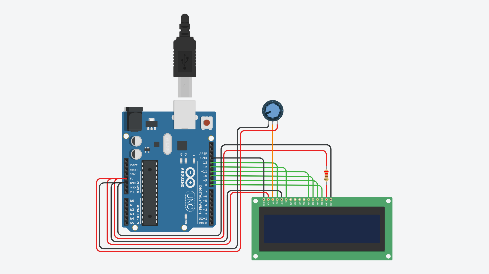

# Punto de dominio

*Hola Legionario!*
:smiley:

Aquí encontrarás la documentación para poder hacerte un punto de dominación simple con Arduino. Este repositorio contiene:
- La lista de componentes que necesitarás
- Las forma en la que deben conectarse los componentes
- El código que debe subirse al Arduino

El proyecto fue realizado con un Arduino Duemilanove, pero es de esperar que funcione exactamente igual en un Arduino UNO.

Si crees que algo se puede mejorar, puedes decírmelo en un issue de este repositorio, o a través de mi [Instagram](https://www.instagram.com/el_legionario_airsoft/).

En general si te ha parecido útil, o quieres alegrarme el día, puedes pasar por mi canal de [YouTube](https://www.youtube.com/c/ElLegionario), suscribirte y dejarme algún comentario de esos que dan ganas de seguir haciendo estas cosas :blush:

## Código

Puedes [descargarte el código](https://github.com/albe89albe/AirsoftDominationPoint/archive/refs/heads/main.zip) o [darle un vistazo](AirsoftDominationPoint.ino), tiene los comentarios en español y está hecho de una forma que considero bastante legible. El código recibirá mejoras, pero siempre contando con que el hardware no cambie, así que cuando te quieras montar el proyecto, simplemente descárgate la última versión, o si ya lo tienes montado con una versión anterior, siempre será seguro actualizar a la última versión. La compatibilidad con versiones anteriores se mantendrá siempre.

Usa el IDE oficial para subir el código `AirsoftDominationPoint.ino` a tu Arduino. Recuerda que siempre te lo puedes descargar gratuitamente desde la [web de Arduino](https://www.arduino.cc/en/software).

## Lista de componentes
(Con su enlace a AliExpress)
1. [Arduino (UNO o Duemilanove)](https://a.aliexpress.com/_vtPUpc)
2. [LCD 1602](https://a.aliexpress.com/_u8qkKa)
3. [Botones (x2)](https://a.aliexpress.com/_uA1KFU)
4. [Buzzer](https://a.aliexpress.com/_uWV2no)
5. [Interruptor simple](https://a.aliexpress.com/_u8kcRY)
6. [Resistor de 220 &#x2126;](https://a.aliexpress.com/_u7olW2)
7. [Potenciómetro de 10 k&#x2126;](https://a.aliexpress.com/_v5eEvk)
8. [Conectores T-Dean](https://a.aliexpress.com/_v3uch8)

No contaré cables, placas, herramientas y consumibles, solo componentes y sus conexiones.

## Conexiones
Esta será la faena complicada para montar este proyecto. Haz uso como entiendas del cableado y de las placas u otras cosas que tengas para conseguir las conexiones que se describen a continuación. Recuerda proteger al máximo de la posibilidad de que terminales que no se deban tocar, se toquen. o sea, asegúrate de usar termoretráctil o cinta aislante donde sea necesario. Si dos cables que no se deben tocar, se tocan, puede no funcionar bien, pero puedes también cargarte algo.

El circuito que tienes que construir es este:

Aquí tienes también las conexiones por separado con imágenes un poco más amigables.

### Arduino - LCD

### Arduino - botones

### Arduino - buzzer

Y eso es todo!
--------------

*Nos vemos en el campo de batalla!* 
:stuck_out_tongue_winking_eye: